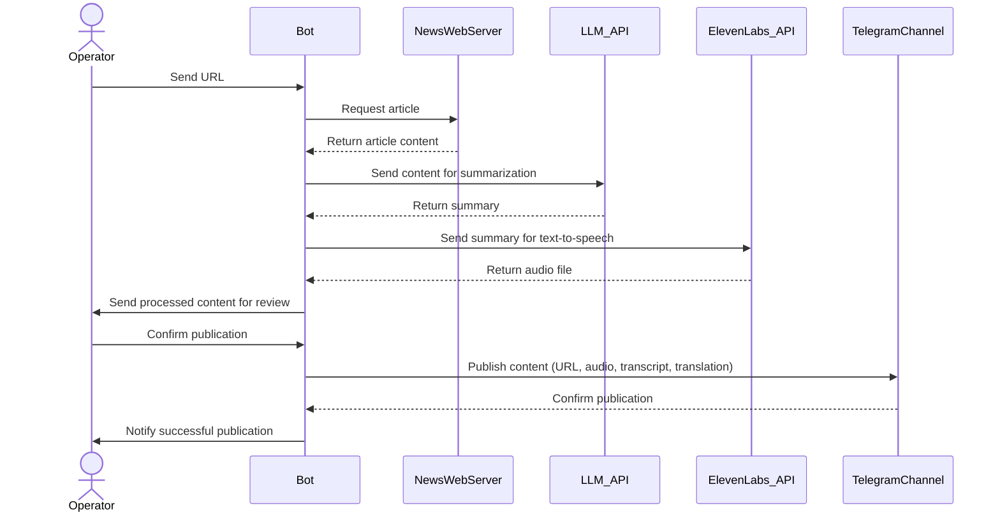

# ChungaChanga Telegram Bot

This Telegram bot is designed to automate the process of curating and distributing news content, with the primary goal of helping non-Spanish speakers improve their Spanish listening and reading skills. It transforms large text news articles into concise summaries, making them more accessible for language learners.

Key features:

- The bot accepts URLs of Spanish news articles from authorized operators.
- It processes each article by summarizing it into 3-4 sentences, making it easier for learners to digest.
- The summary is converted to speech, allowing users to practice their listening skills with native pronunciation.
- A Russian translation of the summary is provided, aiding comprehension for Russian-speaking learners.

After operator approval, the bot publishes the processed content (including the original URL, audio of the summary, Spanish transcript, and Russian translation) to a designated Telegram channel. This streamlined workflow of content distribution creates a regular feed of bite-sized, multi-format Spanish language content for learners.

By presenting news content in this condensed, multi-modal format, the bot helps learners engage with real-world Spanish content, improving their language skills in a practical and engaging way.

## Additional Details

- The bot is configured to parse news articles from multiple sources:
  - crc891.com
  - www.crhoy.com
- Generated content is preserved in a local folder, allowing for future reuse and reducing API calls.
- The bot implements a caching mechanism, storing the correspondence between URLs and generated content. This allows operators to resend previously unconfirmed content without incurring additional costs for summarization and text-to-speech conversion.

## Bot Workflow

The following sequence diagram illustrates the workflow of the ChungaChanga Telegram Bot, showing the interactions between the operator, the bot, and various external services:



## Running the Bot

To run the ChungaChanga Telegram Bot using Docker Compose, follow these steps:

1. Copy the `docker-compose.yml` file to your local machine.

2. Create a `.env` file in the same directory as your `docker-compose.yml` file with the following variables:

    ```shell
    TELEGRAM_BOT_TOKEN=your_telegram_bot_token
    TELEGRAM_CHANNEL_ID=your_telegram_channel_id
    ELEVENLABS_API_KEY=your_elevenlabs_api_key
    AGENT_ENGINE=gemini
    AGENT_ENGINE_API_KEY=your_gemini_api_key
    AGENT_ENGINE_MODEL=gemini-1.5-flash-002
    TELEGRAM_OPERATORS=operator1_id,operator2_id
    ```

    Variable descriptions:
    - `TELEGRAM_BOT_TOKEN`: Your Telegram Bot API token obtained from BotFather.
    - `TELEGRAM_CHANNEL_ID`: The ID of the Telegram channel where the bot will publish content.
    - `ELEVENLABS_API_KEY`: Your API key for ElevenLabs text-to-speech service.
    - `AGENT_ENGINE`: The engine to use for summarization. Can be "gemini" or "openai".
    - `AGENT_ENGINE_API_KEY`: Your API key for the selected engine.
    - `AGENT_ENGINE_MODEL`: The specific model to use for the selected engine.
    - `TELEGRAM_OPERATORS`: Comma-separated list of Telegram user IDs authorized to operate the bot.

3. Run the bot using Docker Compose:

    ```shell
    docker compose up -d
    ```

## Screenshots

1. After inserting a link to the bot, it prepares all the artifacts and waits for confirmation to send them to the dedicated Telegram channel.
2. The channel contains only audio notes with a list of words essential for understanding the particular news.
3. There are comments associated with the message containing the audio notes, so the transcript of the news in Spanish and its translation are available there but intentionally hidden. A tap on the hidden text will reveal the content.

| 1 | 2 | 3 |
|:----:|:----:|:----:|
|  |  |  |

## License

The code (and LLM prompts) in this project is licensed under the Creative Commons BY-NC-SA 4.0 License. See [LICENSE](LICENSE.md) file for details.
